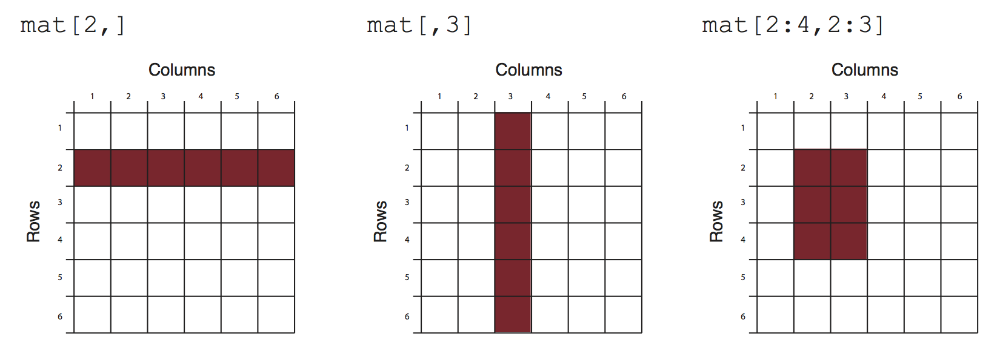

# Introduction to R for biologists

## Basic Data Types in R

### Before Starting

When you're working with R, it's crucial to name your variables properly. Here are some simple rules to follow:

1. Allowed Characters: Variable names can include letters, numbers, underscores (_), and periods (.).

2. Starting Characters: A variable name must start with a letter or a period. It can't start with a number.

3. Case Sensitivity: R treats variable names as case-sensitive. For example, myvar is different from MyVar.

4. Dots in Names: While dots are allowed in variable names, it's best to avoid them except at the beginning.

5. Avoiding Conflicts: Don't use names that match existing functions in R, like mean or c.

#### Examples:

Valid:

* myvar

* my.var

* var1

* var_1

Invalid:

* 1var (can't start with a number)

* _temp (can't start with a _)

* c (matches existing function)

* my-var (hyphens aren't allowed)

* my var (spaces aren't allowed)

#### Tips for Naming:

* Meaningful Names: Choose descriptive names like patient_data instead of generic ones like x, y, or z.

* Short and Clear: Keep your names short but make sure they clearly represent what the variable contains.

* Naming Style: You can use camelCase or underscores_between_words for multi-word names. Make sure to stick to one style and be consistent.

Case Consistency: Decide whether you want all lowercase names or CapWords (also known as PascalCase), and stick to it throughout your code.

By following these naming conventions, your code will be easier to understand, and you'll avoid unexpected errors. Consistency is key when naming variables across your R scripts.

In R, data can be classified into several fundamental types, each serving specific purposes in data analysis and manipulation. Understanding these data types is crucial for effective data handling. Let's explore the primary data types in R:

### 1. Numeric

Numeric data represents continuous numerical values. These can be integers or real numbers (floating-point). Numeric data is used for mathematical calculations and statistical analysis.

Example:

```{r}
# Numeric data
age <- 28
height <- 1.75
```

The `<-` operator and the `=` operator in R are both used for assignment but have some key differences.

The `<-` operator is the standard assignment operator in R. It assigns values to objects.

* The arrow can be read as "gets". So age gets the value of 28.

* All R objects should be created using the `<-` operator.

The `=` Operator can also be used for assignments.

```{r}
age = 28
```

* This also assigns 28 to age.

* The `=` should be read as "is equal to". This is mainly used to specify function arguments.

So in a function call like:

```{r eval=FALSE}
plot(x = mydata)
```

We are specifying that the x argument is equal to mydata.

In summary, `<-` is the operator you should use when creating R objects, while 
`=` is reserved for function arguments. For assignments, both `<-` and `=` can be used.
If you want to read more differences, take a look at https://stat.ethz.ch/R-manual/R-patched/library/base/html/assignOps.html.

### 2. Character (String)

Character data represents text or strings of characters. You use character data for storing and manipulating text-based information, such as names, descriptions, and labels.

Example:

```{r}
# Character data
name <- "John Doe"
city <- "New York"
```

### 3. Integer

Integer data represents whole numbers. Unlike numeric data, which includes decimal points, integer data includes only whole numbers. It's commonly used when dealing with counts or discrete quantities.

Example:
```{r}
# Integer data
count <- 10
students <- 42
```

### 4. Logical (Boolean)

Logical data consists of two possible values: `TRUE` or `FALSE`. These values are used for binary decisions, conditions, and logical operations.

Example:

```{r}
# Logical data
is_student <- TRUE
has_permission <- FALSE
```

### 5. Factor

Factor data represents categorical variables with predefined levels or categories. Factors are used when you have data that can be divided into distinct categories, such as "High," "Medium," and "Low."

Example:

```{r}
# Factor data
grade <- factor(c("A", "B", "C", "B", "A"))
```

### 6. Date and Time

Date and time data types are used for representing dates, times, or both. These data types are crucial when dealing with time series data or conducting temporal analysis.

Example:

```{r}
# Date and time data
birth_date <- as.Date("1990-05-15")
timestamp <- as.POSIXct("2023-01-09 14:30:00")
```


### 7. Missing Values (NA)

In R, missing values are represented as NA. These values indicate the absence of data or an undefined value. Handling missing data is essential in data analysis.

Example:
```{r}
# Missing value
missing_data <- NA
```

Understanding these data types and their characteristics is fundamental to effective data manipulation and analysis in R. Different operations and functions may behave differently depending on the data type, so being familiar with these types will help you work with data effectively.

## The key concept of R: Vectors

In the world of R, vectors are the building blocks of data. In fact, everything in R is a vector. Whether you're dealing with numbers or characters, R treats them all as vectors, which are simply collections of these elements. There is no concept of a scalar in R; even a single value is considered a one-element vector. To create a vector, you'll use the c function, which stands for "combine" or "concatenate."

### Creating Numeric and Character Vectors

Let's dive right in with examples:

```{r}
# A numeric vector
c(1, 2, 3)

# Output: [1] 1 2 3

# A character vector
c("A", "T", "C", "G")

# Output: [1] "A" "T" "C" "G"

```

Notice how `c()` is used to combine values into vectors. Even a single element, such as "A", is a vector in R. Similarly, numeric values like 5 are considered one-element vectors.

### Saving Vectors to Variables

Now, let's save these vectors into variables with meaningful names:

```{r}
number_vec <- c(1, 2, 3)
dna_base <- c("A", "T", "C", "G") 
gene_ids <- c("PAX6", "TP53", "MYC")
```

Remember, it's good practice to use informative variable names. Variable names cannot start with a number, so opt for names like `number_vec` and `dna_base`.

### Vectorized Calculations
One of the powerful features of R is vectorization, where operations are automatically applied element-wise to vectors. For example:

```{r}
number_vec + 1 
```

Here, we've added 1 to each element of `number_vec`. This vectorized behavior simplifies many calculations.

#### Understanding Indexing
You may have noticed the `[1]` that appears in the output. In R, it's called an index, and it indicates the position of each element in the result. For instance:

```{r}
x <- 1:100
x

```

In this case, `[1]` denotes the first position of each element. Understanding indexing helps when working with large datasets.

### Performing Vectorized Calculations
You can perform various calculations on vectors in R:

```{r}
number_vec * 2

# Output: [1] 2 4 6

number_vec / 2

# Output: [1] 0.5 1.0 1.5
```
Remember, all these calculations are vectorized, making R a powerful tool for data manipulation.

### Operations with character vectors

Character vectors in R offer a wide range of operations for text manipulation and analysis. Let's explore some of the essential operations:

#### Concatenation

You can combine character vectors using the c function:

```{r}
new_bases <- c(dna_base, "N")
new_bases
```
This operation is useful for extending or combining character vectors.

#### Changing Case

Transforming the case of characters is straightforward in R. You can convert characters to uppercase or lowercase:

```{r}
toupper(dna_base)

tolower(dna_base)

```

This is handy when you need consistent formatting.

### Logical Vectors

Character vectors also allow for logical operations, which can be incredibly powerful

#### Finding Matches

To check which elements in a character vector meet certain criteria, use the %in% operator:

```{r}
dna_base %in% c("A", "C", "T")
```
This produces a logical vector where `TRUE` indicates a match. This is because the vector dna_base contains `A`, `T`, `C`, `G` and `G` does not match any element in the vector created by `c("A", "C", "T")`.

#### Saving a Logical Vector

Save the resulting logical vector to a new variable for future use:
```{r}
logical_vec <- dna_base %in% c("A", "C", "T")
logical_vec
```

The length of the logical vector matches the original character vector.

#### Negating a Logical Vector
You can negate a logical vector using the `!` operator:

```{r}
!logical_vec
```

Now, `TRUE` represents elements that do not match the criteria.

#### Subsetting with Logical Vectors
Using a logical vector for subsetting another vector is a common operation. It allows you to filter and extract specific elements:

```{r}
# Subsetting elements that meet the criteria
dna_base[logical_vec]

# Subsetting elements that do not meet the criteria
dna_base[!logical_vec]
```

This powerful technique helps you extract and manipulate data efficiently based on specified conditions.


### Conclusion
You've learned the fundamental operations that can be performed on both numeric and character vectors. These essential skills will serve as a strong foundation as you delve deeper into the world of data analysis and manipulation using R.

Remember that vectors are the building blocks of R, and they are used extensively in various data analysis tasks. Whether you're combining elements, changing case, or using logical operations to filter and extract data, you have now gained valuable insights into how vectors can be harnessed to accomplish your data analysis goals.

As you continue your journey in R programming, you'll encounter more complex data structures and operations, but the understanding of vectors will remain a cornerstone of your proficiency.

## Subsetting and Indexing

In this guide, we will explain one of the fundamental concepts for dealing with vectors: indexing and slicing. Understanding how R handles these operations is crucial as it differs from some other programming languages, like Python.

### Indexing in R

In R, unlike Python where indexing starts at 0, it begins at 1. This means that the first element in a sequence is located at position 1, the second at position 2, and so on. Let's dive into some practical examples to illustrate this concept.

```{r}
# Let's create a vector of DNA bases
dna_base <- c("A", "T", "C", "G")

# Accessing the second element (T) using indexing
dna_base[2]

# second and fourth element
dna_base[c(2,4)]
```

Here, we use square brackets `[ ]` to access elements by their position in the dna_base vector. So, `dna_base[2]` returns the second element, which is "T".

### Slicing in R
Slicing in R allows you to extract a chunk of elements from a vector or sequence. You can specify the start and end positions within the square brackets to define the slice.

```{r}
# Slicing the first two elements (A and T) from the dna_base vector
dna_base[1:2]
```

In this example, `dna_base[1:2]` retrieves elements from position 1 to 2, giving us "A" and "T".

### Negative Indexing
R also allows negative indexing to remove that element at that position:

```{r}
# remove first element by negative indexing
remove_first_element <- dna_base[-1]
```

```{r}
# remove second and fourth
dna_base[-c(2,4)]
# Output: [1] "A" "C"
```

### Conclusion
Remember that R starts indexing at 1, not 0, and you can use square brackets `[ ]` to access elements and slices within vectors and sequences. This is essential for working with data and performing various operations in R.

## Understanding and Manipulating Matrices

Matrices are essential for organizing and processing data, especially when dealing with gene expression data from technologies like RNA sequencing (RNAseq). In this tutorial, we will explore how to create, manipulate, and extract information from matrices using the R programming language. We will cover topics ranging from basic matrix operations to more advanced tasks like normalization for RNAseq data analysis.

### Creating a Matrix

To create a matrix in R, you can use the matrix() function. A matrix is essentially a 2-dimensional table for storing numerical data. Let's start by creating a simple matrix:

```{r}
expression_mat <- matrix(1:12, nrow = 3, ncol = 4)
expression_mat
```

Here, `expression_mat` is a dummy gene expression matrix with 3 rows (genes) and 4 columns (samples), where the entries represent counts for each gene in each sample.

### Adding Row and Column Names
You can enhance the clarity of your matrix by adding row and column names. This is particularly useful when dealing with real biological data. For example:

```{r}
rownames(expression_mat) <- c("gene1", "gene2", "gene3")
colnames(expression_mat) <- c("sample1", "sample2", "sample3", "sample4")
expression_mat
```

Now, instead of numerical indices, your matrix displays gene and sample names, making it easier to interpret.

### Subsetting a Matrix
Subsetting allows you to extract specific rows and columns from a matrix. You can use numerical indices, row/column names, or logical vectors. Remember, R is 1-based. Indices start at 1 while Python starts at 0.



#### Subsetting using numerical indices

```{r}
# Accessing a single element
expression_mat[1, 2]
```

slice a chunk

```{r}
expression_mat[1:2, 1:2]
```

If you leave either the row index blank or the column index, it will subset all the rows or columns. Subset the first two rows and all columns:

```{r}
expression_mat[1:2,]
```

Subset the columns 2 and 4 and all rows

```{r}
expression_mat[, c(2,4)]
```

#### Subsetting using row names

```{r}
# Accessing a specific gene's data
expression_mat["gene3", ]
```

When only one row or one column is left after subsetting, R returns a vector instead of a matrix. To return a single row or column matrix, add `drop=FALSE`.

```{r}
expression_mat["gene3", , drop=FALSE]
```

#### Subsetting using column names

```{r}
# Using predefined gene and sample names
differential_genes<- c("gene3", "gene1")
expression_mat[differential_genes, c("sample1", "sample2")]
```

You see how the matrix is subsetted and the row names are ordered as in `differential_genes`.

#### Subsetting using logical vectors

We have a matrix called `expression_mat` that contains gene expression data, and you want to subset it to include only the rows corresponding to certain "differential genes." Here's how you can do it:

```{r}
logical_vec_genes <- rownames(expression_mat) %in% differential_genes
expression_mat[logical_vec_genes,]
```

## data frame 

### What is a Data Frame?
A data frame is a two-dimensional tabular data structure in R. It is similar to a spreadsheet or a database table, where rows and columns intersect to form a grid-like structure. In a data frame, each row can hold different types of data, such as numbers, text, or factors, but all columns must have the same number of rows and each column should have the same data type.

### Creating a Data Frame

To create a data frame, you can use the `data.frame()` function. Here's an example of creating a simple data frame for patient data in a biology study.

```{r}
patient_data <- data.frame(
  id = c("P1", "P2"),
  age = c(42, 36),
  status = c("normal", "tumor")
)
```

In this example, we have three vectors (id, age, and status) that are combined into a data frame. The variable names of the vectors become the column names of the data frame. You can see the resulting data frame by simply typing `patient_data`.

```{r}
patient_data
```

### Accessing Columns
You can access individual columns within a data frame using the `$` sign, which is similar to accessing elements in a list. For instance:

```{r}
patient_data$id
```

This command will retrieve the `id` column from the `patient_data` data frame.

Similarly, you can access the `status` column by using `patient_data$status`.

### Subsetting a Data Frame
Subsetting a data frame means extracting specific rows and columns based on your analysis needs. You can use square brackets `[row_indices, column_indices]` to subset or slice the data frame, similar to subsetting a matrix.

For example, to select the first row and the first and third columns from the patient_data data frame:

```{r}
patient_data[1, c(1, 3)]
```

This command returns a subset of the data frame with the `id` and `status` columns for the first row.

### Conclusion
In biology research, data frames are invaluable for organizing and analyzing diverse datasets. Imagine you have a dataset with patient information, where each row represents a patient and columns contain attributes like age, gender, and diagnosis. You could use data frames to filter patients by specific criteria, calculate summary statistics, or create visualizations to gain insights into your biological data.

Data frames in R serve as the backbone for handling and exploring data in a structured and meaningful way, making them an essential tool for any biologist or data scientist working in the field of life sciences.


## heatmap 

Making heatmap is an essential skill for any computational biologist.

### load the libraries 

```{r}
library(ComplexHeatmap)
```

### make dummy data 

```{r}

h1 <- c(10,20,10,20,10,20,10,20)
h2 <- c(20,10,20,10,20,10,20,10)

l1 <- c(1,3,1,3,1,3,1,3)
l2 <- c(3,1,3,1,3,1,3,1)

mat <- rbind(h1,h2,l1,l2)
colnames(mat)<- paste0("timepoint_", 1:8)
mat
```


visualize the data 

```{r}
par(mfrow =c(1,1), mar=c(4,4,1,1))
plot(1:8,rep(0,8), ylim=c(0,35), pch="", xlab="Time", ylab="Gene Expression")

for (i in 1:nrow(mat)) {
lines(1:8,mat[i,], lwd=3, col=i)
}

legend(1,35,rownames(mat), 1:4, cex=0.7)
```

### Making a heatmap is easy!

```{r}
Heatmap(mat, cluster_columns = FALSE)

quantile(mat, c(0, 0.1,0.5, 0.9))
```


change color mapping 

```{r}
col_fun<- circlize::colorRamp2(c(0, 3, 20), c("blue", "white", "red"))

Heatmap(mat, cluster_columns = FALSE, col = col_fun)
```


outlier 

```{r}
mat2<- mat
mat2[1,1]<- 1000

Heatmap(mat2, cluster_columns = FALSE)

Heatmap(mat2, cluster_columns = FALSE, col = col_fun)

```

Let's scale the data/gene expression level across columns (time points) first

```{r}
scaled_mat<- t(scale(t(mat)))


?Heatmap
Heatmap(scaled_mat, cluster_columns = FALSE)
```

Note, after scaling, h1 and l1 are close to each other!

### understand clustering?

define distances 

```{r}
?dist

d<- dist(mat)

d
```


```{r}
?hclust

hclust(d)


plot(hclust(d))
```


After scaling 
```{r}

d2<- dist(scaled_mat)

plot(hclust(d2))
```

Key takeaways:
1. color mapping is critical
2. scaling is critical 
3. making heatmap is easy, but better to understand the details.


